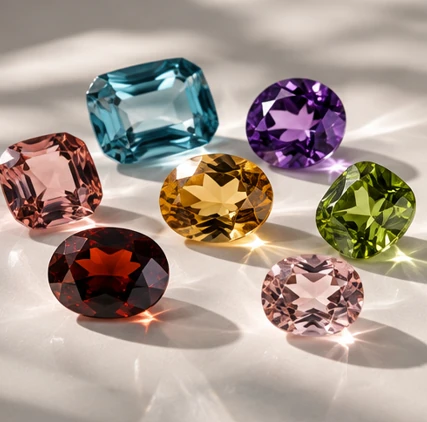

# MERVELLE GEMSTONES – Code-Dokumentation

Diese Datei erklärt die komplette technische Struktur der Website, damit spätere Änderungen ohne Neuentwicklung möglich sind.

## 1. Projektstruktur

```text
gemstone-jewelry-site/
├── index.html                     Hauptseite
├── impressum.html                 Impressum
├── datenschutz.html               Datenschutzerklärung
├── bildhinweise.html              Hinweise zu Bildern
├── README.md                      Kurzanleitung für Bilder und Deployment
├── CODE-DOKUMENTATION.md          Diese technische Dokumentation
│
├── assets/
│   ├── styles.css                 Gesamtes Layout und responsive Design
│   ├── script.js                  Navigation, Filter, Modal, Scroll-Story, Formular
│   ├── favicon.svg                Browser-Icon
│   │
│   ├── brand/
│   │   ├── mervelle-logo.png      Offizielles vollständiges Logo
│   │   └── mervelle-mark.png      Nur das M-Signet; aktuell nicht im Header verwendet
│   │
│   ├── data/
│   │   └── catalog-data.js        Automatisch generierte Produktdaten
│   │
│   └── catalog/                   Produktbilder nach Kategorie/Farbe
│       ├── perlen/
│       ├── straenge/
│       ├── rohsteine/
│       ├── geschliffen/
│       └── beads/
│
├── tools/
│   └── build_catalog.py           Erzeugt catalog-data.js aus den Bildordnern
│
└── .github/workflows/
    └── deploy-pages.yml           Automatisches GitHub-Pages-Deployment
```

## 2. Die wichtigsten Änderungen an einer Stelle

Am Ende von `assets/styles.css` gibt es den Block:

```css
/* MERVELLE CUSTOMIZATION BLOCK */
```

Dort sollten Designänderungen zuerst vorgenommen werden. Besonders wichtig sind diese Variablen:

```css
:root {
  --header-bg: rgba(12,9,6,.96);       /* Menü-Hintergrund oben */
  --header-bg-scrolled: #0d0b08;       /* Menü-Hintergrund nach Scrollen */
  --header-accent: #d7b982;            /* Champagner-/Goldton */
  --header-text: #f3eadc;              /* Menü-Schriftfarbe */
  --header-logo-width: 300px;           /* Logo-Größe Desktop */
}
```

### Logo größer oder kleiner machen

Nur diesen Wert ändern:

```css
--header-logo-width: 300px;
```

Zum Beispiel:

```css
--header-logo-width: 340px;
```

Für Tablet und Mobil gibt es weiter unten eigene Werte in den Media Queries.

### Menü-Hintergrund ändern

Für einen komplett schwarzen Header:

```css
--header-bg: #0d0b08;
--header-bg-scrolled: #0d0b08;
```

Für einen leicht transparenten Header nur ganz oben kann `--header-bg` mit `rgba(...)` gesetzt werden. Sobald gescrollt wird, fügt JavaScript die Klasse `.is-scrolled` hinzu und der Header wird vollständig deckend.

## 3. index.html

Die `index.html` enthält die komplette Seitenstruktur. Die wichtigsten Bereiche sind direkt mit HTML-Kommentaren markiert:

```html
<!-- HEADER -->
<!-- HERO -->
<!-- INTRO -->
<!-- SORTIMENT -->
<!-- SOURCING STORY -->
<!-- BENEFITS -->
<!-- ABOUT -->
<!-- REQUEST FORM -->
<!-- CONTACT -->
<!-- FOOTER -->
<!-- PRODUCT MODAL -->
```

### Hero-Hintergrund ändern

Im HERO-Bereich steht:

```html
<div class="hero-bg" aria-hidden="true">
  
</div>
```

Einfach den `src`-Pfad durch ein anderes lokales Bild ersetzen.

### Haupttexte ändern

Texte können direkt in `index.html` geändert werden. Die Überschrift im Hero ist z. B.:

```html
<h1 id="hero-title">Les trésors<br><em>de la Terre.</em></h1>
```

### Logo ändern

Header, About-Bereich und Footer verwenden alle dasselbe vollständige Logo:

```text
assets/brand/mervelle-logo.png
```

Soll später ein neues offizielles Logo verwendet werden, kann diese Datei bei gleichem Dateinamen ersetzt werden. Dann muss kein HTML-Code geändert werden.

## 4. styles.css

`assets/styles.css` enthält das gesamte Design.

Wichtige Bereiche:

- `:root` – Farben, Schriften, allgemeine Variablen
- `.site-header` – Navigation/Header
- `.hero` – Startbereich
- `.intro` – Unternehmensintro
- `.assortment` / `.catalog-*` – Produktkatalog
- `.sourcing-*` / `.story-*` – Scroll-Story
- `.about-*` – Über-uns-Bereich
- `.request-*` – Anfrageformular
- `.contact-*` – Kontaktbereich
- `.site-footer` – Footer
- `.product-modal` – Produkt-Popup
- `@media (...)` – Tablet-/Mobile-Anpassungen

## 5. script.js

`assets/script.js` ist in Funktionsblöcke unterteilt.

### Header-Kontrast

```js
const updateHeaderState = () =>
  header?.classList.toggle('is-scrolled', window.scrollY > 16);
```

Sobald mehr als 16 Pixel gescrollt wurde, bekommt der Header die Klasse `.is-scrolled`. Dadurch bleibt das Menü auch über hellen Seitenbereichen lesbar.

### Mobile Navigation

Der Button mit `data-menu-toggle` öffnet/schließt die Navigation auf kleinen Bildschirmen.

### Dynamischer Produktkatalog

Die Produkte kommen aus:

```js
window.MERVELLE_CATALOG
```

Diese Daten werden nicht manuell im HTML geschrieben, sondern aus `assets/data/catalog-data.js` gelesen.

`renderCatalog()` übernimmt:

- Kategorie-Filter
- Farbfilter
- Suche
- Sortierung
- Trefferanzahl
- Erzeugung der Produktkarten

### Produkt-Popup

Ein Klick auf eine Produktkarte öffnet das `<dialog>` in `index.html`. Die Daten werden dynamisch aus dem gewählten Produkt übernommen.

### Scroll-Story

Die Funktion `setActiveStory()` und die Scroll-Berechnung steuern den mittleren Story-Bereich. Es wird immer der Abschnitt aktiviert, dessen Mittelpunkt am nächsten an einer festen Bildschirmposition liegt. Dadurch wird das frühere Zurückspringen vermieden.

### Anfrageformular

Das Formular sendet aktuell noch keine Daten an einen Server. Es erzeugt nur lokal einen strukturierten Anfragetext und versucht diesen in die Zwischenablage zu kopieren.

Vor Livegang muss ein echtes Formular-Backend oder E-Mail-Service angebunden werden.

## 6. Bilder automatisch hinzufügen

Bilder immer nach diesem Schema speichern:

```text
assets/catalog/KATEGORIE/FARBE/dateiname.webp
```

Beispiel:

```text
assets/catalog/straenge/blau/lapislazuli-rund.webp
```

Danach lokal ausführen:

```bash
python tools/build_catalog.py
```

Bei GitHub Pages geschieht das automatisch beim Push.

## 7. Produktinformationen mit JSON ergänzen

Neben einem Bild kann eine JSON-Datei mit gleichem Namen liegen:

```text
lapislazuli-rund.webp
lapislazuli-rund.json
```

Beispiel:

```json
{
  "title": "Lapislazuli-Stränge, rund",
  "description": "Polierte Lapislazuli-Kugelstränge in verschiedenen Größen.",
  "alt": "Blaue Lapislazuli-Stränge",
  "tags": ["lapislazuli", "blau", "kugel", "strang"],
  "order": 25,
  "featured": false
}
```

`tools/build_catalog.py` liest diese Angaben ein. Fehlt die JSON-Datei, werden Titel, Kategorie und Farbe automatisch aus Dateiname und Ordnerstruktur abgeleitet.

## 8. GitHub Pages

`.github/workflows/deploy-pages.yml` führt bei jedem Push auf `main` oder `master` folgende Schritte aus:

1. Repository laden
2. Python einrichten
3. `python tools/build_catalog.py` ausführen
4. Website für GitHub Pages vorbereiten
5. Website veröffentlichen

In GitHub muss unter **Settings → Pages → Build and deployment** die Quelle **GitHub Actions** ausgewählt sein.

## 9. Cache bei Änderungen

In `index.html` werden CSS und JavaScript mit einer Versionsnummer geladen:

```html
<link rel="stylesheet" href="assets/styles.css?v=9">
<script src="assets/script.js?v=9" defer></script>
```

Wenn GitHub Pages oder der Browser alte Dateien cached, kann die Zahl erhöht werden:

```text
?v=10
```

Dadurch wird die neue Datei zuverlässig geladen.

## 10. Rechtliche Seiten

Vor Veröffentlichung müssen insbesondere in `impressum.html` und `datenschutz.html` alle Platzhalter durch echte Unternehmensdaten ersetzt werden.

Das aktuelle Anfrageformular überträgt keine Daten. Sobald ein Formularservice, Analytics, Karten, Videos, externe Fonts oder Marketing-Pixel integriert werden, müssen Datenschutz und gegebenenfalls Consent-Management erneut geprüft werden.

## 11. Empfohlener Workflow für spätere Änderungen

### Nur Text ändern
`index.html` bearbeiten → speichern → GitHub pushen.

### Farbe/Logo-Größe/Layout ändern
`assets/styles.css` bearbeiten → im `MERVELLE CUSTOMIZATION BLOCK` beginnen.

### Funktion ändern
`assets/script.js` bearbeiten.

### Produktbild hinzufügen
Bild in `assets/catalog/...` ablegen → optional JSON ergänzen → `build_catalog.py` ausführen oder zu GitHub pushen.

### Neues offizielles Logo
`assets/brand/mervelle-logo.png` ersetzen und Dateinamen beibehalten.
